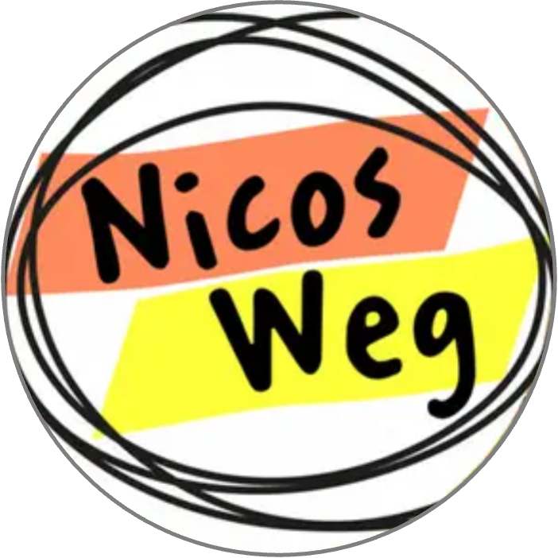

# Day 6 - Sechster Tag

## 👀 1) Reading Comprehension

1️⃣ Read the short German text below

2️⃣ Answer the comprehension questions.

You can use a dictionary if needed — but _try to understand from context first._

### Story

Anja is telling you about her plans today:

> Heute treffe ich eine gute Freundin in meinem Lieblingscafé in Berlin. Das ist immer so schön!
> 
> Ich gehe zum Café und setze mich an einen Tisch für zwei Personen. Dann überlege ich, was ich bestellen möchte. Es gibt so viele leckere Sachen. Ich entscheide mich für einen Cappuccino und ein Stück Kuchen.
> 
> Wir sitzen an unserem Tisch und plaudern. Das Café ist gemütlich und ruhig. Meine Freundin und ich genießen unseren Kaffee und den Kuchen. Der Kaffee ist heiß, und der Kuchen ist süß. Wir haben eine tolle Zeit zusammen.
> 
> Nach einer Weile ist es Zeit zu bezahlen. Ich gebe der Kellnerin das Geld und bedanke mich. Dann verabschieden wir uns und gehen.
> 
> Cafés sind wunderbare Orte, um Zeit mit Freunden zu verbringen. Ich freue mich schon auf das nächste Treffen in meinem Lieblingscafé.

### Questions

1. Wo trifft Anja ihre Freundin?
2. An welchen Tisch setzt sie sich?
3. Worüber denkt Anja nach, als sie sitzt?
4. Wofür entscheidet sie sich?

**Speak or write your answers in German.**

**Try not to just copy/paste the answers from the text but write your responses in full sentences as much as possible.**

---

## 🎧 2) Listening Practice

**Goal:** Build listening comprehension and active vocabulary.

### Task

- Listen to the video. Try not to read the transcript.
- Listen to the video again but use the transcript for help if needed.
- Write down 5 words you learned from the video.
- Write down answers to the question below.

### Video

[Nico's Weg](https://learngerman.dw.com/de/nicos-weg/c-36519687) is a series of short episodes telling the story of a Spanish student traveling to Germany. Watch the video and then click on `Start` to answer the questions.

Watch the first episode: [Nico's Weg - Hallo!](https://learngerman.dw.com/de/hallo/l-40322767)

If you'd like, you can also watch the [second episode - Kein Problem!](https://learngerman.dw.com/de/kein-problem/l-40324275)

---

## ✍️ 3) Writing

We want to practice formulating full sentences. Here, you will **write** a short paragraph in response to the following prompt:

📌 _“Was würdest Du machen wenn du deine Tasche am Flughafen verliert hättest?"_

Include:

- Was würdest du zuerst machen?
- Erzähle wie du das genau machen würdest.
- Was sind noch andere Optionen?

## 🗣 4) Speaking

We are starting off with speaking. Usually, we have a prompt here that you will formulate a response to. We'll try to just have a conversation for 10 to 15 minutes about anything that comes to mind. Some ideas:

- Was du am Tag so gemacht hast (_your day overall_)
- Was war heute in der Schule los? (_school related things_)
- Was sind deine Pläne für dein Wochenende? (_weekend plans_)